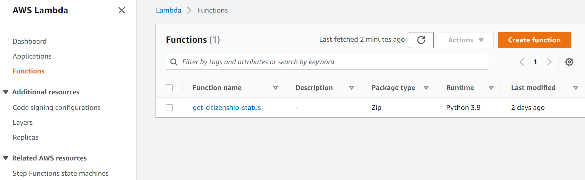
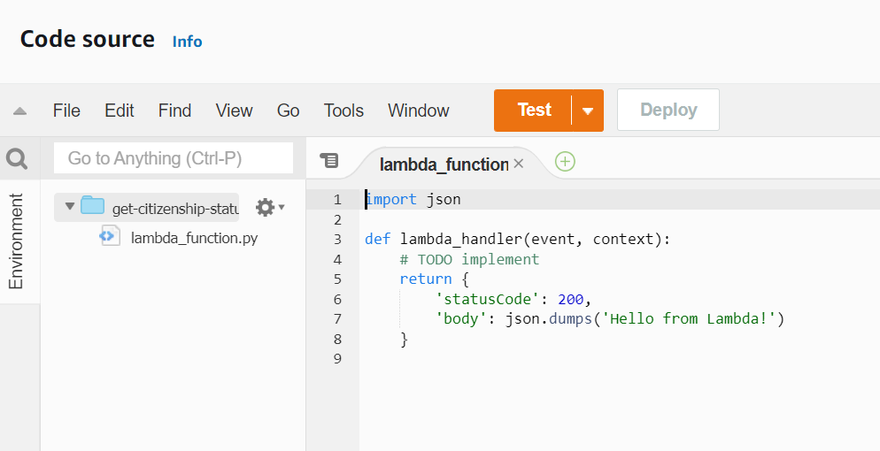
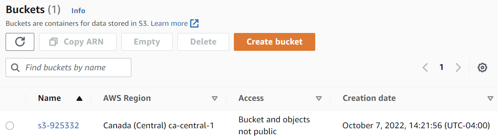
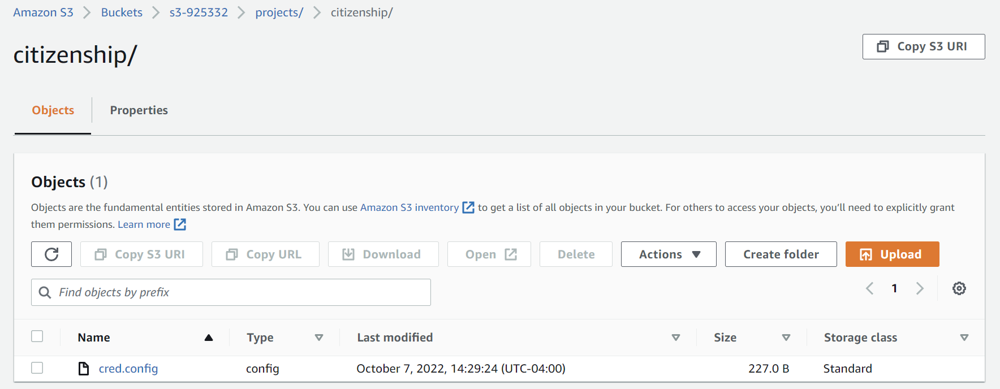

# Building a serverless script that checks the status for Canadian citizenship application

I'm waiting to get my Canadian citizenship. In theory, I should know about all important updates about my case by email. Rumor is, sometimes these emails do not arrive due to some glitches, so it's still better to check the citizenship application tracker every day. Oh my, a repetitive manual task that I might need to be doing for around a year? This just begs for automation. 


## Simple version

My first iteration is to whip up some Python code that takes credentials from a config file, logs into the tracker, shows the tracker window and parses most important information - date of last update and timeline milestones. This script alone saves me from opening the window and logging in, and it checks status both for me and for my partner. But let's be honest - it's not fully automated! I want to be able to check the status while on my phone, or, better yet, to get notified when something changes, without any need for manual actions!

So my biggest ambition now is to wrap the code into a labmda function which runs every day or gets triggered from a Telegram bot! 🤩 
The question is - will I make before my citizenship process is completed?

` hello world `

## Serverless version

What we have now:
Python code

### Why Lambda?

EC2 vs Lambda

A sample AWS Lambda function

> 

> 

### Figuring out storage

Available options...  
Let it be S3 due to pricing, see...

Create a new S3 bucket. Assign a unique name (tip: generate a random number to generate a unique name).  
Keep ACLs disabled by default. Block all public access to this bucket.  
Versioning off for now. What are the downsides of enabling versioning?



Copy the ARN of the new bucket.

Click on the name of the new bucket and go to the Objects tab to create folders and to upload the config file. 




### Giving Lambda access to S3

Create a new execution role according to the guide:

https://aws.amazon.com/premiumsupport/knowledge-center/lambda-execution-role-s3-bucket/

Insert the ARN of the S3 bucket copied on the previous step and add "/\*" at the end, so that the new inline policy statement looks like this:

```
{
    "Version": "2012-10-17",
    "Statement": [
        {
            "Sid": "S3AccessStatement",
            "Action": [
                "s3:GetObject"
            ],
            "Effect": "Allow",
            "Resource": [
                "arn:aws:s3:::s3-925332/*"
            ]
        }
    ]
}
```

Go to the list of Lambda functions and select our function. In Configuration - Execution role - Choose Edit. In the dropdown of existing roles choose the previously created role. 

### Reading from S3

#### Python

A sample script reading from S3 in Python would look like this:

```
import json
import boto3
 
def lambda_handler(event, context):
    s3_client = boto3.client("s3")
    s3_bucket_name = 's3-925332'
    object_key = 'projects/citizenship/cred.config'
    file_content = s3_client.get_object(
      Bucket=s3_bucket_name, Key=object_key)["Body"].read()
    return {
        'statusCode': 200,
        'body': file_content
    }
```

#### Node.js

A sample script reading from S3 in Node.js would look like this:

```
const AWS = require('aws-sdk')

exports.handler = async (event) => {
    var s3 = new AWS.S3();
    let contentFile;
    let response;
    try {
    const file = await s3
      .getObject({ Bucket: 's3-925332', Key: 'projects/citizenship/cred.config' })
      .promise();
    contentFile = file.Body.toString();
    response = {
        statusCode: 200,
        body: contentFile,
    };
    } catch (err) {
    response = {
        statusCode: 500,
        body: err,
    };
    }
    return response;
};
```

AWS Lambda has acces to AWS SDK by default, but not the latest version. 

Note that:


```
const file = await s3
    .getObject({ Bucket: 's3-925332', Key: 'projects/citizenship/cred.config' })
    .promise();
```

same as

```
const file = await s3.getObject({ Bucket: 's3-925332', Key: 'projects/citizenship/cred.config' }).promise();
```

An example using puppeteer on nodejs:  
https://gist.github.com/apal21/4746f9d3935f24485e40d5fd054f3202

https://gist.github.com/apal21/80c2cfe3606d30ae7d1c655ba6100ea4 - thank you for the example!


### Accessing a webpage from Lambda

A layer with Selenium and Chromium in python:
https://github.com/vittorio-nardone/selenium-chromium-lambda

Awesome layers:
https://github.com/mthenw/awesome-layers

Before layers:
https://robertorocha.info/setting-up-a-selenium-web-scraper-on-aws-lambda-with-python/ (cool data journalist!)

Issues:
https://stackoverflow.com/questions/67807768/chrome-driver-and-chromium-binaries-are-not-working-on-aws-lambda

Using puppetter:  
https://awstip.com/how-to-run-puppeteer-on-aws-lambda-using-layers-b1583ebd7120  
(layer with puppeteer) https://github.com/RafalWilinski/serverless-puppeteer-layers   (not recently updated)


(npm) https://acloudguru.com/blog/engineering/serverless-browser-automation-with-aws-lambda-and-puppeteer  
(dockerfile) https://aws.amazon.com/blogs/architecture/field-notes-scaling-browser-automation-with-puppeteer-on-aws-lambda-with-container-image-support/  
(decrease size) https://oxylabs.io/blog/puppeteer-on-aws-lambda  
(configuring) https://medium.com/limehome-engineering/running-pyppeteer-on-aws-lambda-with-serverless-62313b3fe3e2  

(installing pupeteer) https://www.npmjs.com/package/chrome-aws-lambda  
(some discussion on above) https://stackoverflow.com/questions/57408181/how-to-bundle-headless-chromium-module-with-aws-lambda
(github) https://github.com/alixaxel/chrome-aws-lambda - looks good but without a preconfigured layer. should use puppetter-core

(fresh preconfigured layer) https://www.npmjs.com/package/@sparticuz/chromium
https://github.com/Sparticuz/chromium

(fresh preconfigured layer) https://github.com/shelfio/chrome-aws-lambda-layer
(using above) https://acloudguru.com/blog/engineering/serverless-browser-automation-with-aws-lambda-and-puppeteer
(also using above) https://www.techmagic.co/blog/running-headless-chrome-with-aws-lambda-layers/
(above mentioned in the comments) https://dev.to/gerybbg/puppeteer-in-an-aws-lambda-function-part-2-4hfi

---

Let's try using https://www.npmjs.com/package/@sparticuz/chromium. It's fresh! 
Downloaded a layer generated by the actions in the repo:
https://github.com/Sparticuz/chromium/actions -> chromium.zip

Upload to S3 bucket.
Create folder named lib. Upload zip to the folder. copy the URL.
Go to console - Lambda - Layers - Create layer. Paste the URL.

Go to Lambda - Function - citizenship-ircc. Click on the Layers in the chart which brings you to the bottom of the page. Add a new custom layer and specify it as the newly created chromium-aws.

It's only chromium! 
Let's find puppeteer too.
Chromium 107.0.5296.0 - Puppeteer v18.1.0 - this would make me install puppeteer-core from somewhere else. 

We probably will need to install npm locally to create the layer.

---

Let's try https://github.com/shelfio/chrome-aws-lambda-layer. Go to Lambda - Functions - citizenship-ircc. Click on the Layers in the chart which brings you to the bottom of the page. Add a new custom layer and specify ARN for your region from https://github.com/shelfio/chrome-aws-lambda-layer.

Now the function works! Both dependencies (puppeteer-core and chromium) are found. This is a default node.js stub created by Amazon with only two checks for dependencies added.

```
exports.handler = async (event) => {
    const puppeteer = require("puppeteer-core");
    const chromium = require("@sparticuz/chrome-aws-lambda");
    const response = {
        statusCode: 200,
        body: JSON.stringify('Hello from Lambda!'),
    };
    return response;
};
```


### Accessing Lambda through REST APIs

https://stackoverflow.com/questions/50276852/lambda-function-within-vpc-doesnt-have-access-to-public-internet

https://medium.com/@shontauro/how-can-i-turn-my-restful-api-into-a-serverless-application-and-deploy-it-to-aws-lambda-step-by-ec7ce38e18be
