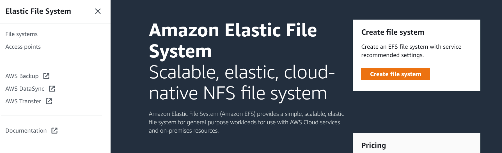
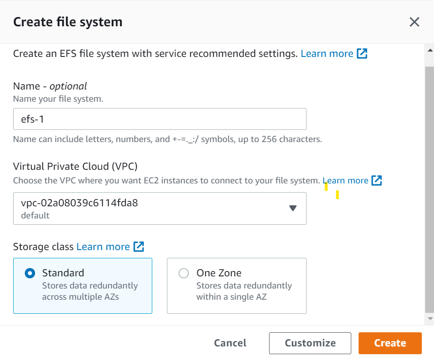
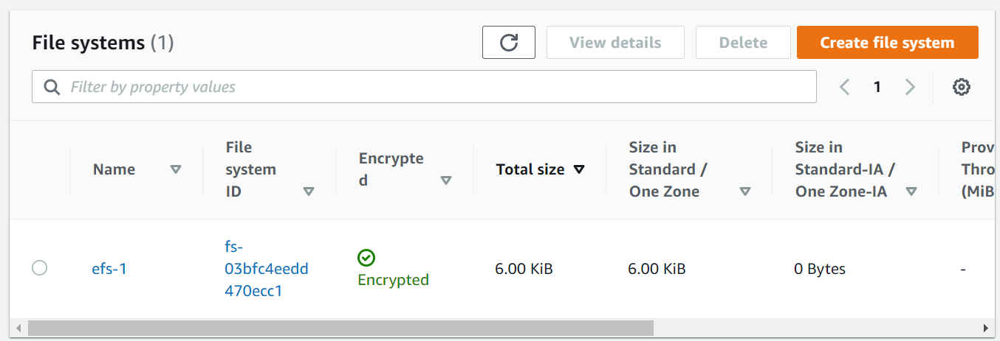
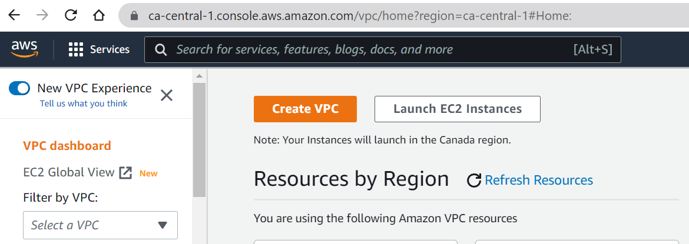
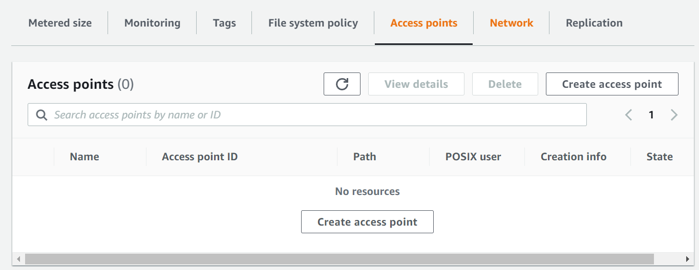

# Building a serverless script that checks the status for Canadian citizenship application

I'm waiting to get my Canadian citizenship. In theory, I should know about all important updates about my case by email. Rumor is, sometimes these emails do not arrive due to some glitches, so it's still better to check the citizenship application tracker every day. Oh my, a repetitive manual task that I might need to be doing for around a year? This just begs for automation. 

## Simple version

My first iteration is to whip up some Python code that takes credentials from a config file, logs into the tracker, shows the tracker window and parses most important information - date of last update and timeline milestones. This script alone saves me from opening the window and logging in, and it checks status both for me and for my partner. But let's be honest - it's not fully automated! I want to be able to check the status while on my phone, or, better yet, to get notified when something changes, without any need for manual actions!

So my biggest ambition now is to wrap the code into a labmda function which runs every day or gets triggered from a Telegram bot! 🤩 
The question is - will I make before my citizenship process is completed?

` hello world `

## Serverless version

What we have now:
Python code

### Why Lambda?

EC2 vs Lambda

A sample AWS Lambda function

> 

> 

### Figuring out storage
The credentials are stored in a config file, so we need to put the file somewhere our function can access. 

Functions can use /tmp space up to 512MB. That would be more than enough space for us, but /tmp is ephemeral, meaning that it may get emptied by AWS between function runs. We need something persistent. 

Another option would be to host a file outside of AWS, like on GitHub. However, the file is senstitive, because it contains credentials for the IRCC account, so at least it should be stored in a private repository, not a public one! I believe that code hosting site is not an appropriate place for credentials, so I want to place the file somewhere in AWS. 

This gives us a choice between AWS storage offerings. [Here](https://dzone.com/articles/confused-by-aws-storage-options-s3-ebs-amp-efs-explained) to read about the difference between S3, EBS and EFS. For our case we just need a basic text file stored, so EFS suits us the best. EFS provides us basic file structure paradigm for storing a simple file in a conventional format, and it provides us elasticity of size, which means we only use as much disk space as our small file needs. 
One of consequences of using AWS Storage is the need to configure our Lambda function to work within VPC.
https://aws.amazon.com/blogs/compute/using-amazon-efs-for-aws-lambda-in-your-serverless-applications/

We create an instance of EFC by searching for EFC and Creating a File System.
>  

Any name will do. Choose a default VPC. 
> 

And it's created!
> 

### Figuring out VPC

We need to have communication between our Lambda function, our storage and the internet. Storage should be private and not accessible from the internet. Thus, Lambda function need to be able to connect to the private area and to the public area. This is set up using VPC.

Amazon says:
> When you connect a function to a VPC in your account, it does not have access to the internet unless your VPC provides access. To give your function access to the internet, route outbound traffic to a NAT gateway in a public subnet
> https://docs.aws.amazon.com/lambda/latest/dg/configuration-vpc.html?icmpid=docs_lambda_console#vpc-internet
> By default, Lambda runs your functions in a secure VPC with access to AWS services and the internet. Lambda owns this VPC, which isn't connected to your account's default VPC. When you connect a function to a VPC in your account, the function can't access the internet unless your VPC provides access.

> Lambda functions always run inside VPCs owned by the Lambda service. As with customer-owned VPCs, this allows the service to apply network access and security rules to everything within the VPC. These VPCs are not visible to customers, the configurations are maintained automatically, and monitoring is managed by the service.
> When you use some AWS services, they create resources that are only accessible from within your customer VPC. To access these resources with Lambda, your Lambda function must also be configured for access to the same VPC. Importantly, unless you are accessing services with resources in a customer VPC, there is no additional benefit to add a VPC configuration.
(https://docs.aws.amazon.com/lambda/latest/operatorguide/networking-vpc.html)
So if we didn't need to connect to storage, there would be no need to set up VPC either by editing our account's default VPC or creating a new one. 

Go to VPC dashboard and click Create VPC:

Choose VPC and more (it means creating of subnets, routing tables, network connections).
In my case the suggested setup starts with a default configuration with subnets spread across two availability zones, with 1 public and 1 private subnet on each availability zone.

Change the project name if needed. 

You don't need to specify NAT:

>  NAT gateways enable resources in private subnets to reach the internet. 

**Hypothesis:** In our case we don't need any internet connection from the private subnet where our storage is located. Lambda function will have access to both private and and public subnet. Or no? Or can we use endpoints instead? 
**Hypothesis:** If we put Lambda in the public subnet, then we only need interenet gateway and not NAT gateway. Pay close attention to security then. 

**To explore:** NAT instance as a cheaper alternative to the NAT gateway.

**To explore:** Public Lambda, attaching gateway to the VPC (https://aws.amazon.com/premiumsupport/knowledge-center/create-attach-igw-vpc/).

**Possible solution with downsides:** Public Labmda with Elastic IP as public IP ( https://stackoverflow.com/questions/55771064/how-to-choose-elastic-ip-when-my-aws-lambda-function-execute )

https://docs.aws.amazon.com/vpc/latest/userguide/VPC_Internet_Gateway.html

> If a subnet is associated with a route table that has a route to an internet gateway, it's known as a public subnet. If a subnet is associated with a route table that does not have a route to an internet gateway, it's known as a private subnet.

https://www.tinystacks.com/blog-post/aws-cost-optimization-nat-instances-vs-nat-gateways/

> For public Internet data transfers, you may want to move your data transfers out of a private subnet and into a public subnet. Traffic that flows through an Internet gateway accrues no additional charges. The trade-off is that you'll lose some of the security benefits from running within a private subnet. If you go this route, ensure that your network security policies on your public subnet are strictly configured to prevent attempted ingress from malicious actors.

https://aws.amazon.com/premiumsupport/knowledge-center/internet-access-lambda-function/

https://docs.aws.amazon.com/vpc/latest/userguide/VPC_Internet_Gateway.html

https://aws.amazon.com/premiumsupport/knowledge-center/vpc-reduce-nat-gateway-transfer-costs/

https://docs.aws.amazon.com/vpc/latest/userguide/VPC_NAT_Instance.html

https://aws.amazon.com/premiumsupport/knowledge-center/internet-access-lambda-function/

https://aws-core-services.ws.kabits.com/two-tier-application-linux/vpc/create-vpc/

NAT gateway is unreasonably expensive. It's $30-35 per month. 
Opinion: projects without PII or PCI data probably do not use private subnets in the beginning. 

Here they say lambda cannot just be put in public subnet: 

https://devops.stackexchange.com/questions/4944/placing-an-aws-lambda-in-a-public-subnet

https://stackoverflow.com/questions/52992085/why-cant-an-aws-lambda-function-inside-a-public-subnet-in-a-vpc-connect-to-the

https://stackoverflow.com/questions/52992085/why-cant-an-aws-lambda-function-inside-a-public-subnet-in-a-vpc-connect-to-the#:~:text=Be%20sure%20that%20all%20the,times%20without%20any%20obvious%20cause.

Default config:
https://docs.aws.amazon.com/vpc/latest/userguide/VPC_Scenario2.html

?? lambda in private subnet? or in custom vpc? or in its own vpc but connected to a custom vpc? 

https://docs.aws.amazon.com/lambda/latest/dg/configuration-vpc.html?icmpid=docs_lambda_console#vpc-internet
https://dev.to/aws-builders/how-to-connect-efs-disk-to-a-lambda-function-360g

### Attaching storage to the Lambda function

Select the newly created file system, go to Details - Access points. There are none yet, so let's create an access point for our EFS file system.

>  

I'll define name as lambda-citizenship-efs and will not specify any POSIX parameters for now and leave all other parameters at default or empty values.

Now go to the list of Lamda functions, select the needed function, go to Actions - View details - Configuration - VPC - Edit VPC. Choose your default VPC.
Select all subnets and default security group. 

Error:
> AWS Lambda:The provided execution role does not have permissions to call DescribeNetworkInterfaces on EC2

Execution role: https://docs.aws.amazon.com/lambda/latest/dg/lambda-intro-execution-role.html

NB: drawing!

More info at https://aws.amazon.com/blogs/compute/using-amazon-efs-for-aws-lambda-in-your-serverless-applications/

### Allowing Lambda to access EFS system

https://docs.aws.amazon.com/lambda/latest/dg/configuration-filesystem.html

### Allowing Lambda to access internet

https://aws.amazon.com/premiumsupport/knowledge-center/internet-access-lambda-function/

### Uploading the file to EFC

AWS Lambda:The provided execution role does not have permissions to call DescribeNetworkInterfaces on EC2

### Accessing Lambda through REST APIs
