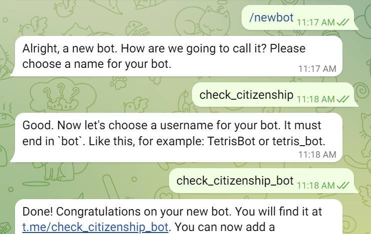
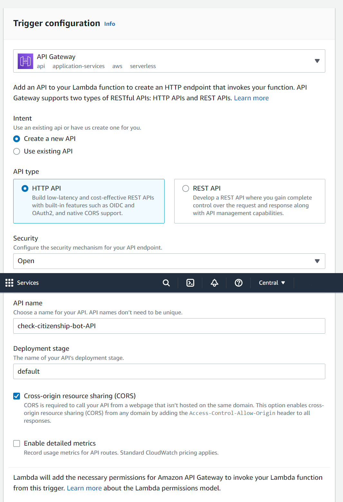
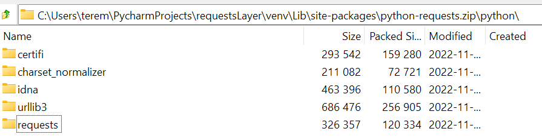
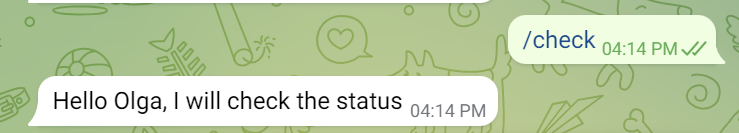

Useful links:
https://medium.com/hackernoon/serverless-telegram-bot-on-aws-lambda-851204d4236c
https://levelup.gitconnected.com/simple-telegram-bot-with-python-and-aws-lambda-5eab1066b466

I will not use the Serverless framework for now, because I want to figure out all steps that the framework hides under the hood. 

Steps:
1. Create a new Telegram bot and get Telegram API token.
   1. Write to @BotFather in Telegram to create a new bot.  
   <p align="center"></p>
   2. Copy a token returned by BotFather.
2. Create a Python 3.9 Lambda function named citizenship-status-bot.
   1. Execution role - select that predefined role with S3 access right away.
   2. Environment variables - add a new variable TELEGRAM_TOKEN and paste the value of the token. 
   3. Create an API endpoint as a trigger. Go to Function overview - Add trigger. Follow the steps described at https://docs.aws.amazon.com/lambda/latest/dg/services-apigateway.html:  
   <p align="center"></p>  
   The newly created trigger will show the API endpoint. 
3. Provide the API endpoint as a webhook for the bot.  
   Send this command in the terminal (replace [TELEGRAM_TOKEN] and [API_ENDPOINT] with your values):
   
   ```
   curl --request POST --url https://api.telegram.org/bot[TELEGRAM_TOKEN]/setWebhook --header 'content-type: application/json' --data '{"url": "[API_ENDPOINT]"}'
   ```
   
   Response:  
   
   ```
   {"ok":true,"result":true,"description":"Webhook was set"}
   ```
4. Write code in Python to handle incoming requests from the bot in the lambda function.
   A simple program which reads a message sent by the bot:
   
   ```
   import json
   import os
   import sys
   
   TOKEN = os.environ['TELEGRAM_TOKEN']
   BASE_URL = "https://api.telegram.org/bot{}".format(TOKEN)
   
   def lambda_handler(event, context):
       data = json.loads(event["body"])
       message = str(data['message']["text"])
       chat_id = data["message"]["chat"]["id"]
       first_name = str(data["message"]["chat"]["first_name"])
       if "check" in message:
           response = "Hello {}, I will check the status".format(first_name)
           print(response)
       
       return {
           'statusCode': 200,
           'body': json.dumps('Hello from Lambda!')
       }
   ```

4. Import requests module into the lambda function. 
   
   To install requests you may follow this tutorial: https://www.gcptutorials.com/article/how-to-use-requests-module-in-aws-lambda . Basically you need to install requests locally, zip it up and upload to AWS. 
   
   Something similar can be done using PyCharm:
   1. Create a new project requestsLayer and choose a new venv for it.
   2. Install requests in this project.
   3. Go to the project path requestsLayer\venv\Lib\site-packages, create a directory 'python' and copy there directories:
      - certifi, 
      - charset_normalizer
      - idna
      - urllib3
      - requests  
      This list includes requests and required dependencies. This list can be compiled from the list of directories pip creates when installing the library (excluding pip-related libraries like pip, wheel, setuptools), or from the METADATA file in the requests-\*-info directory. 
   4. Zip up the python directory into the file python-requests.zip.
      <p align="center"></p>
   5. Upload the python-requests.zip, create a Lambda layer pointing at this file and add this layer to the Lambda function.

5. Use requests to send messages back to the chat with the bot.
   
   Now we can add following lines to send the message back to the bot.
   
   ```
   import requests
   response = "Hello {}, I will check the status".format(first_name)
   data_res = {"text": response.encode("utf8"), "chat_id": chat_id}
   url = BASE_URL + "/sendMessage"
   requests.post(url, data_res)
   ```
   
   <p align="center"></p>

6. Create a new Python 3.9 Lambda function named citizenship-status-bot-send to actually send the results. As the scraping function is quite bulky, I'm not a fan of the initial function being idle for a minute to get the results. Let's try running the intake function, the scraping function and then the sending function. 
   1. Execution role - select that predefined role with S3 access right away.
   2. Environment variables:
      - Add a new variable TELEGRAM_TOKEN and paste the value of the token. 
      - Add a new variable BUCKET_NAME and paste the value of S3 bucket.
   3. Add the python-requests layer.
   4. We will use the parameter event expecting it to contain the following:  
      {"name":"first name of the user", "chat_id":"id of the chat"}
   5. Write code for taking text files from S3 and sending the result back to the telegram chat:
      
      ```
      import json
      import boto3
      import requests
      import os
      
      TOKEN = os.environ['TELEGRAM_TOKEN']
      BASE_URL = "https://api.telegram.org/bot{}".format(TOKEN)
      BUCKET_NAME = os.environ['BUCKET_NAME']  # name of the AWS S3 bucket to store configs and results
      PROJECT_PATH = 'projects/citizenship/' # path in the S3 bucket to the project directory 

      def lambda_handler(event, context):
          s3_client = boto3.client("s3")
          listKeysText = s3_client.list_objects_v2(Bucket = BUCKET_NAME, Delimiter = '/', Prefix = PROJECT_PATH + 'output/timeline-text/');
          keysTextContents = listKeysText['Contents']
          print(keysTextContents)
          str_update = ''
          
          for obj_key in keysTextContents:
              file_key = obj_key['Key']
              file = s3_client.get_object(Bucket = BUCKET_NAME, Key = file_key)
              file_content = file['Body'].read()
              file_dict = json.loads(file_content)
              print(file_dict)
              str_update += (file_dict['name'] + ': ' + file_dict['lastUpdateDate'] + ' | ')
          
          str_update = 'Dates of last update | ' + str_update
          
          first_name = event['name']
          chat_id = event['chat_id']
          
          response = "{}, this is your result: \n".format(first_name) + str_update
          data_res = {"text": response.encode("utf8"), "chat_id": chat_id}
          url = BASE_URL + "/sendMessage"
      
          requests.post(url, data_res)
              
          return {
              'statusCode': 200,
              'body': json.dumps('Hello from Lambda!')
          }
   
      ```
   
   6. While writing the function and debugging, we can find out the value of chat_id and create a test event with the following content in Event JSON:
      
      ```
      {
      "name": "Olga",
      "chat_id": "219021910"
      }
      ```

   7. Send screenshots of timelines
      1. Iterate through files to return pictures
      2. Open the file
      3. Form a request using multipart-data option and pass the file as a parameter  
         
         ```
         listKeysPic = s3_client.list_objects_v2(Bucket = BUCKET_NAME, Delimiter = '/', Prefix = PROJECT_PATH + 'output/timeline-pic/');
         keysPicContents = listKeysPic['Contents']
         print(keysPicContents)
         
         for obj_key in keysPicContents:
             file_key = obj_key['Key']
             file = s3_client.get_object(Bucket = BUCKET_NAME, Key = file_key)
             file_content = file['Body'].read()
             file_dict = {"photo": file_content}
             data_res = {"chat_id": chat_id, "caption": "Test Caption"}
             url = BASE_URL + "/sendPhoto"
             requests.post(url, data = data_res, files = file_dict)
         ```
   TO-DO: iterate through the list of people to check (maybe send them over from the last step)
